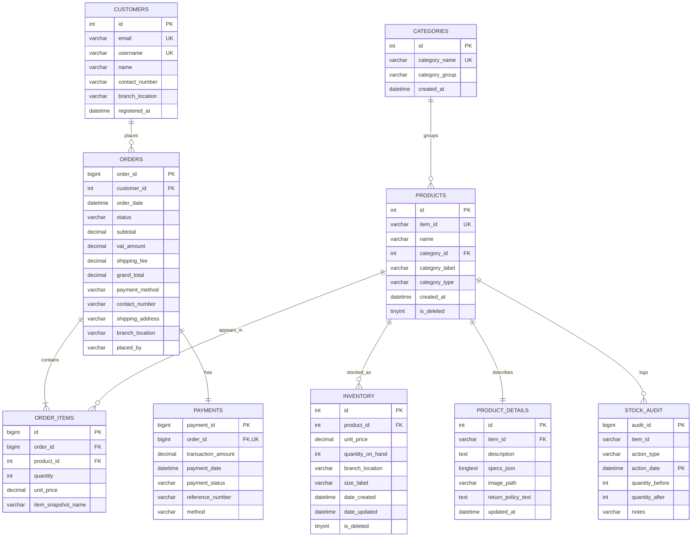

# ERD

This file shows the main database structure from the project brief in [CORE_PROJECT.MD](CORE_PROJECT.MD).

## Main ERD

## Notes

- `orders -> payments` is one-to-one because `payments.order_id` is unique.
- Price and stock are stored in `inventory` to avoid duplicated values in `products`.
- `stock_audit` is partitioned by date.